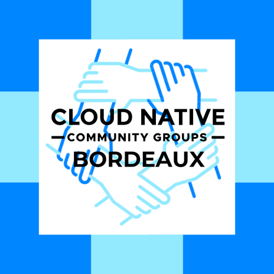
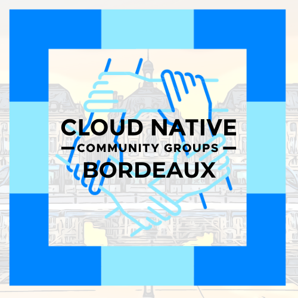
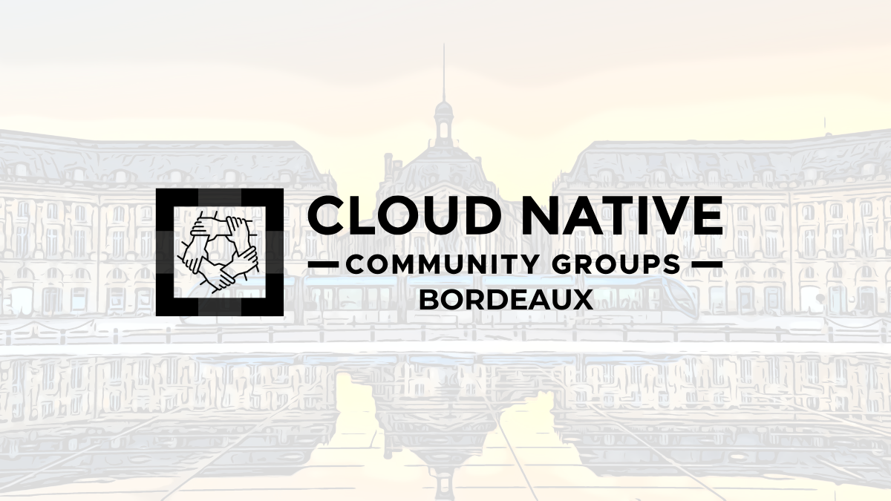

# Cloud Native Community Groups – Bordeaux

Ce dépôt contient les éléments graphiques officiels du **Cloud Native Community Group de Bordeaux**.  
Il s’inspire du modèle [CNCF Artwork Repository](https://github.com/cncf/artwork/blob/main/examples/other.md#cloud-native-community-groups) et respecte les [CNCF Brand Guidelines](https://www.cncf.io/brand-guidelines/#colors).

---

## 🖼️ Logos et variantes

| Version | Aperçu | Fichier |
|----------|---------|---------|
| Logo principal (fond clair) |  | [`logo-bordeaux-cncf-primary.png`](./logos/logo-bordeaux-cncf-primary.png) |
| Logo principal (fond transparent) |  | [`logo-bordeaux-cncf-transparent.png`](./logos/logo-bordeaux-cncf-transparent.png) |
| Pictogramme seul (fond clair) |  | [`logo-bordeaux-cncf-icon-light.png`](./logos/logo-bordeaux-cncf-icon-light.png) |
| Pictogramme seul (fond transparent) |  | [`logo-bordeaux-cncf-icon.png`](./logos/logo-bordeaux-cncf-icon.png) |

---

## 🎨 Utilisation

Les logos et éléments visuels de ce dépôt sont destinés à représenter la communauté **Cloud Native Bordeaux** dans le cadre d’événements, publications ou supports officiels.

Merci de suivre les règles d’usage ci-dessous :
- Ne pas altérer les proportions ou les couleurs des logos.
- Préserver des marges suffisantes autour du logo.
- Utiliser les variantes adaptées selon le fond (clair / foncé / photo).
- Pour tout usage externe (sponsor, presse, etc.), merci de conserver le lien avec la CNCF.

Référence : [CNCF Brand Guidelines → Colors & Usage](https://www.cncf.io/brand-guidelines/#colors)

---

## 📫 Contact & communauté

Ce dépôt est maintenu par les organisateurs du **Cloud Native Community Group – Bordeaux**.  
👉 Retrouvez-nous sur [CNCF Community](https://community.cncf.io/cloud-native-bordeaux/),  [Meetup.com](https://www.meetup.com/cloud-native-computing-bordeaux/) ou sur [LinkedIn](https://www.linkedin.com/company/105540955/).

---

_Cloud Native Community Groups Bordeaux est une initiative communautaire affiliée à la CNCF (Cloud Native Computing Foundation)._
